# LearnFlow AI

<p align="center">
  
</p>

<p align="center">
  <b>AI-powered study assistant for smarter learning.</b>
  <br />
  Upload PDFs • Chat with documents • Generate notes • Create flashcards • Practice quizzes
</p>

<p align="center">
  <a href="https://learn-flow-r11dhrlj0-tarun218s-projects.vercel.app">
    
  </a>
  
  <a href="https://github.com/Tarun218/LearnFlow-AI">
    
  </a>

  <a href="https://tarunsingodia-learnflow-ai-backend.hf.space">
    
  </a>
</p>

---

# ✨ Overview

LearnFlow AI is a modern AI-powered study platform designed to help students learn faster and more efficiently.

Users can upload PDFs and instantly:
- chat with study material,
- generate smart notes,
- create flashcards,
- practice AI-generated quizzes,
- and organize learning in one elegant workspace.

The platform combines:
- Retrieval-Augmented Generation (RAG),
- semantic search,
- AI-powered summarization,
- and an interactive study dashboard.

---

# 🚀 Live Demo

## 🌐 Frontend

👉 https://learn-flow-r11dhrlj0-tarun218s-projects.vercel.app

## ⚡ Backend API

👉 https://tarunsingodia-learnflow-ai-backend.hf.space

---

# 📸 Screenshots

> All screenshots are stored inside:
>
> `docs/screenshots/`

---

## 🏠 Landing Page

### Hero Section
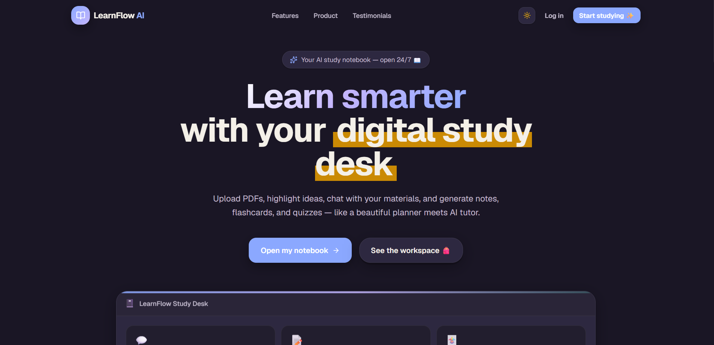

### Features Overview
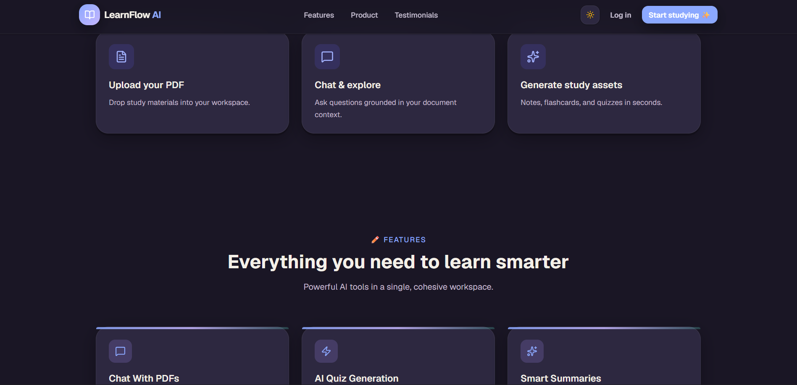

### Statistics Section
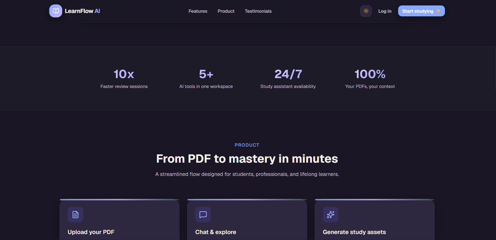

### Learning Experience
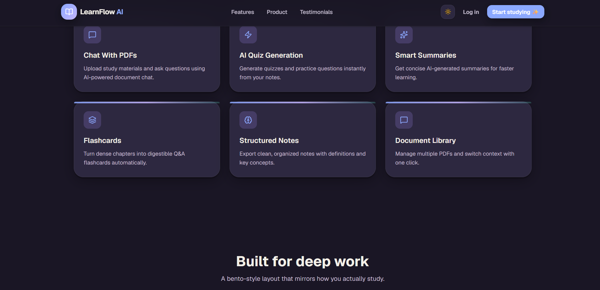

### Dashboard Preview
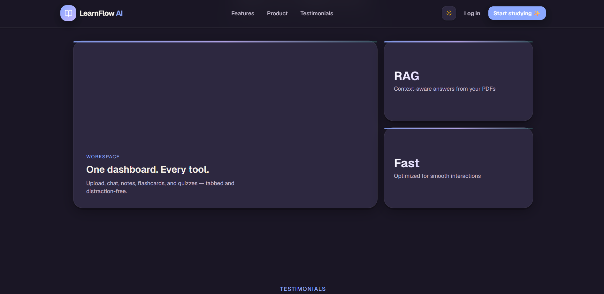

### Footer Section
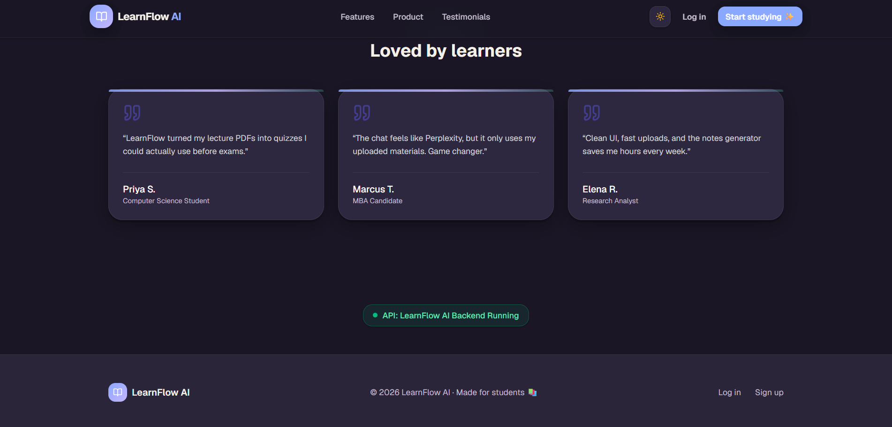

---

## 🔐 Authentication

### Signup Page
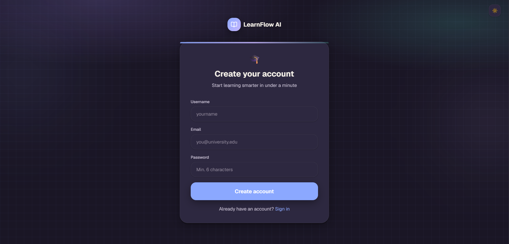

---

## 📚 Study Dashboard

### PDF Upload Workspace
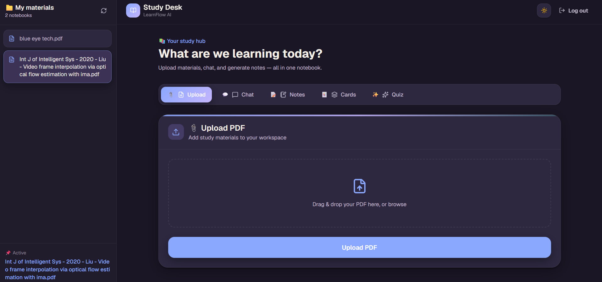

---

## 💬 AI Chat Assistant

### Chat Interface
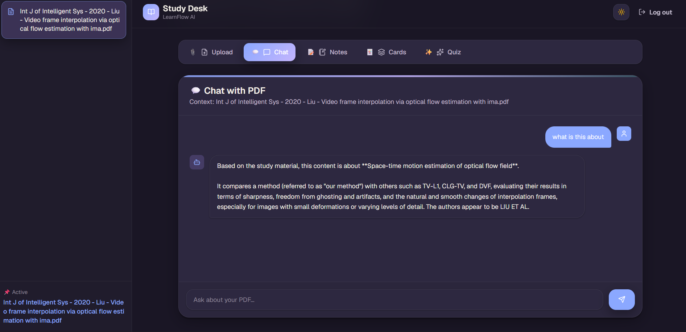

---

## 🧠 Flashcards Generation

### Smart Flashcards
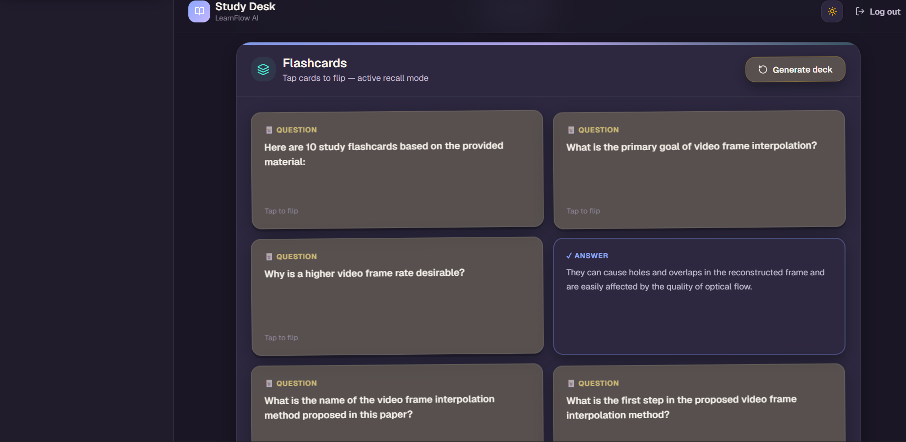

---

## 📝 Quiz Generation

### AI Quiz Generator
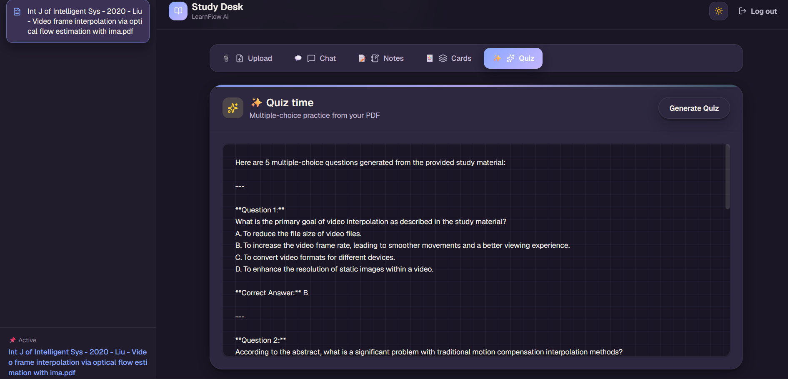

---

## 📝 Notes Generation

### AI Notes Summarization
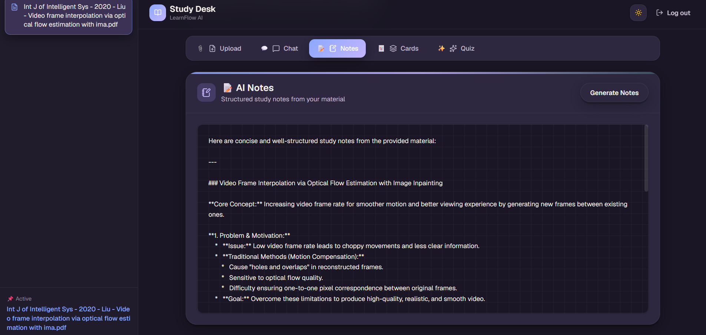

---

## 🧠 Flashcards Generator

- AI-generated flashcards
- Interactive flip animations
- Active recall learning

---

## ❓ Quiz Generator

- Multiple-choice quizzes
- AI-generated practice questions
- Quick revision support

---

## 🎨 Modern Study-Themed UI

- Animated interface
- Dark & light modes
- Notebook-inspired design
- Responsive layout
- Smooth transitions & interactions

---

# 🏗️ System Architecture

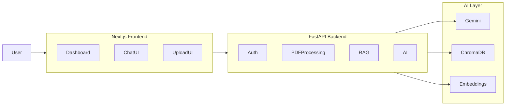

---

# 🛠️ Tech Stack

## Frontend

- Next.js
- React
- TypeScript
- Tailwind CSS
- Framer Motion
- Zustand

---

## Backend

- FastAPI
- SQLAlchemy
- SQLite
- JWT Authentication
- ChromaDB

---

## AI & ML

- Google Gemini API
- Sentence Transformers
- Vector Embeddings
- Retrieval-Augmented Generation (RAG)

---

## Deployment

- Vercel (Frontend)
- Hugging Face Spaces (Backend)

---

# 📂 Project Structure

```bash
LearnFlow-AI/
│
├── frontend/
│   ├── src/
│   ├── public/
│   └── components/
│
├── backend/
│   ├── routes/
│   ├── services/
│   ├── models/
│   ├── schemas/
│   └── database/
│
└── README.md
```

---

# ⚙️ Local Setup

# 1️⃣ Clone Repository

```bash
git clone https://github.com/Tarun218/LearnFlow-AI.git

cd LearnFlow-AI
```

---

# 2️⃣ Backend Setup

```bash
cd backend

python -m venv venv

# Windows
venv\Scripts\activate

# Linux/Mac
# source venv/bin/activate

pip install -r requirements.txt

cp .env.example .env
```

Add:

```env
GEMINI_API_KEY=your_key
JWT_SECRET_KEY=your_secret
```

Run backend:

```bash
python -m uvicorn main:app --reload --port 8000
```

---

# 3️⃣ Frontend Setup

Open new terminal:

```bash
cd frontend

npm install

cp .env.example .env.local
```

Add:

```env
NEXT_PUBLIC_API_URL=http://127.0.0.1:8000
```

Run frontend:

```bash
npm run dev
```

---

# 🔐 Environment Variables

## Frontend

```env
NEXT_PUBLIC_API_URL=
```

---

## Backend

```env
GEMINI_API_KEY=
JWT_SECRET_KEY=
CORS_ORIGINS=
```

---

# 🌍 Deployment

## Frontend → Vercel

- Import GitHub repository
- Select `frontend` as root directory
- Add environment variable:

```env
NEXT_PUBLIC_API_URL=YOUR_BACKEND_URL
```

Deploy.

---

## Backend → Hugging Face Spaces

- Create Docker Space
- Upload backend
- Add secrets:

```env
GEMINI_API_KEY=
JWT_SECRET_KEY=
CORS_ORIGINS=
```

Deploy.

---

# 📡 API Endpoints

| Method | Endpoint | Description |
|---|---|---|
| POST | `/signup` | Register user |
| POST | `/login` | User login |
| POST | `/upload-pdf` | Upload PDF |
| POST | `/chat` | Chat with document |
| POST | `/generate-notes` | Generate notes |
| POST | `/generate-flashcards` | Generate flashcards |
| POST | `/generate-quiz` | Generate quiz |

---

# 🧪 Future Improvements

- Study planner
- Spaced repetition
- AI memory
- PDF highlighting
- Export notes
- Multiplayer study rooms
- Voice interaction

---

# 👨‍💻 Author

## Tarun Singodia

- GitHub: https://github.com/Tarun218

Built with passion for students, AI, and smarter learning.

---

# ⭐ Support

If you like this project:

- Star the repository
- Share it with others
- Fork and contribute

---

# 📄 License

This project is built for educational and portfolio purposes.
