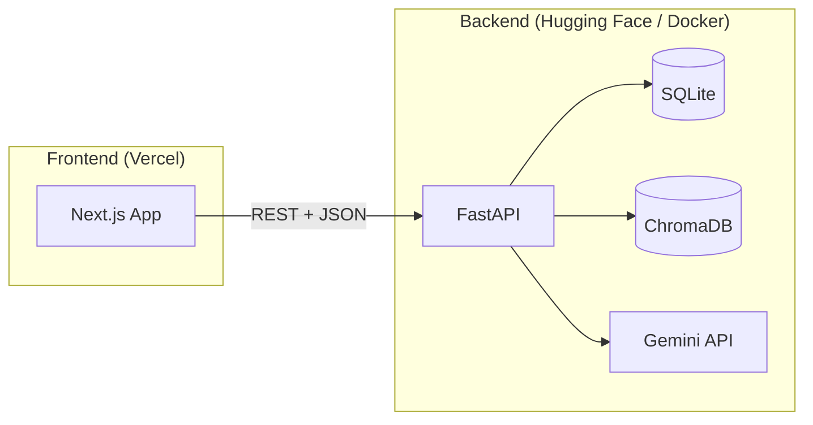

# LearnFlow AI

**Your AI-powered digital study notebook** — upload PDFs, chat with your materials, and generate notes, flashcards, and quizzes in one beautiful workspace.

[](https://nextjs.org/)
[](https://fastapi.tiangolo.com/)
[](https://ai.google.dev/)

---

## Features

| Feature | Description |
|---------|-------------|
| **PDF upload** | Upload study PDFs; text is extracted and indexed for AI |
| **Chat with PDF** | Ask questions grounded in your document (RAG via ChromaDB) |
| **AI summaries** | Quick summaries on upload |
| **Notes** | Structured study notes from your latest document |
| **Flashcards** | Tap-to-flip Q&A cards for active recall |
| **Quizzes** | Multiple-choice practice generated from your material |
| **Auth** | Email signup/login with JWT |
| **Themes** | Light (notebook) and dark (cozy study-night) modes |

---

## Architecture



---

## Tech stack

| Layer | Technologies |
|-------|----------------|
| **Frontend** | Next.js 16, React 19, TypeScript, Tailwind CSS v4, Framer Motion, Zustand |
| **Backend** | FastAPI, SQLAlchemy, SQLite, ChromaDB, Sentence Transformers |
| **AI** | Google Gemini (`gemini-2.5-flash`) |
| **Auth** | JWT (python-jose), bcrypt passlib |

---

## Project structure

```
LearnFlowAI/
├── frontend/          # Next.js app (deploy to Vercel)
│   ├── src/
│   │   ├── app/       # Pages: /, /login, /signup, /dashboard
│   │   ├── components/
│   │   └── lib/       # API client (api.ts)
│   └── .env.example
├── backend/           # FastAPI API (deploy to Hugging Face / Docker)
│   ├── routes/        # auth, upload, chat, notes, quiz, flashcards
│   ├── services/      # Gemini, embeddings, Chroma
│   ├── Dockerfile
│   └── .env.example
└── README.md
```

---

## Prerequisites

- **Node.js** 20+
- **Python** 3.11+
- **Gemini API key** — [Google AI Studio](https://aistudio.google.com/apikey)

---

## Local development

### 1. Clone the repository

```bash
git clone https://github.com/Tarun218/LearnFlow-AI.git
cd LearnFlow-AI
```

### 2. Backend setup

```bash
cd backend

# Create virtual environment
python -m venv venv

# Activate (Windows)
venv\Scripts\activate
# Activate (macOS/Linux)
# source venv/bin/activate

pip install -r requirements.txt

# Configure environment
cp .env.example .env
# Edit .env — set GEMINI_API_KEY and JWT_SECRET_KEY

# Run API
python -m uvicorn main:app --reload --host 127.0.0.1 --port 8000
```

API docs: [http://127.0.0.1:8000/docs](http://127.0.0.1:8000/docs)

> **Note:** First request may be slow while embedding models download.

### 3. Frontend setup

Open a **new terminal**:

```bash
cd frontend

npm install

cp .env.example .env.local
# Set: NEXT_PUBLIC_API_URL=http://127.0.0.1:8000

npm run dev
```

App: [http://localhost:3000](http://localhost:3000)

---

## Environment variables

### Frontend (`frontend/.env.local`)

| Variable | Required | Description |
|----------|----------|-------------|
| `NEXT_PUBLIC_API_URL` | Yes | Backend base URL, **no trailing slash** |

### Backend (`backend/.env`)

| Variable | Required | Description |
|----------|----------|-------------|
| `GEMINI_API_KEY` | Yes | Google Gemini API key |
| `JWT_SECRET_KEY` | Yes | Long random string for JWT signing |
| `CORS_ORIGINS` | Prod | Comma-separated frontend URLs |
| `CORS_ORIGIN_REGEX` | Optional | e.g. `https://.*\.vercel\.app` |

---

## Deployment

### Frontend → [Vercel](https://vercel.com)

1. Import this GitHub repository on Vercel.
2. Set **Root Directory** to `frontend`.
3. Add environment variable:

   | Name | Value |
   |------|--------|
   | `NEXT_PUBLIC_API_URL` | Your production backend URL |

4. Deploy. Redeploy after changing `NEXT_PUBLIC_*` variables (baked in at build time).

### Backend → [Hugging Face Spaces](https://huggingface.co/spaces) (Docker)

1. Create a new **Docker** Space.
2. Push or sync the `backend/` folder (or full repo with `sdk: docker` and path to `backend/Dockerfile`).
3. Set Space **Secrets / Variables**:

   ```
   GEMINI_API_KEY=...
   JWT_SECRET_KEY=...
   CORS_ORIGINS=https://your-app.vercel.app
   CORS_ORIGIN_REGEX=https://.*\.vercel\.app
   ```

4. Space runs on port **7860** (see `backend/Dockerfile`).
5. Use the Space URL as `NEXT_PUBLIC_API_URL` on Vercel.

### Backend → Docker (any host)

```bash
cd backend
docker build -t learnflow-api .
docker run -p 7860:7860 \
  -e GEMINI_API_KEY=your_key \
  -e JWT_SECRET_KEY=your_secret \
  -e CORS_ORIGINS=https://your-frontend.vercel.app \
  learnflow-api
```

---

## API overview

All endpoints use the base URL from `NEXT_PUBLIC_API_URL`.

| Method | Endpoint | Description |
|--------|----------|-------------|
| `GET` | `/` | Health check |
| `POST` | `/signup` | Register (JSON body) |
| `POST` | `/login` | Login → JWT |
| `POST` | `/upload-pdf` | Upload PDF (multipart) |
| `GET` | `/documents` | List indexed documents |
| `POST` | `/chat` | Chat with PDF (JSON: `question`, `document_id`) |
| `POST` | `/summarize` | Summarize text |
| `POST` | `/generate-notes` | Generate notes |
| `POST` | `/generate-flashcards` | Generate flashcards |
| `POST` | `/generate-quiz` | Generate quiz |

Interactive docs: `{API_URL}/docs`

---

## GitHub checklist

Before pushing, confirm:

- [ ] No `.env` or API keys committed (use `.env.example` only)
- [ ] `backend/uploads/` and `backend/chroma_db/` are gitignored
- [ ] `npm run build` passes in `frontend/`
- [ ] Backend starts locally with valid `GEMINI_API_KEY`
- [ ] Vercel `NEXT_PUBLIC_API_URL` points to live backend
- [ ] Hugging Face `CORS_ORIGINS` includes your Vercel URL

```bash
# Quick verify before push
cd frontend && npm run build
cd ../backend && python -c "from main import app; print('OK', app.title)"
```

---

## CI

GitHub Actions runs on push/PR to `main`:

- Frontend: `npm ci` → `lint` → `build`

See [`.github/workflows/ci.yml`](.github/workflows/ci.yml).

---

## Troubleshooting

| Issue | Fix |
|-------|-----|
| `ERR_CONNECTION_REFUSED` on live site | Set `NEXT_PUBLIC_API_URL` on Vercel and **redeploy** |
| CORS errors | Add exact Vercel URL to `CORS_ORIGINS` on backend; restart Space |
| `Failed to fetch` / timeout | Wake Hugging Face Space; first load can take 1–2 min |
| Chat returns generic errors | Upload a PDF first; select document in sidebar |
| Build fails on Vercel | Ensure root directory is `frontend` |

---

## Contributing

1. Fork the repository  
2. Create a feature branch: `git checkout -b feature/my-feature`  
3. Commit changes and open a PR  
4. Ensure CI passes  

---

## License

This project is provided for educational and portfolio use. Add a license file if you open-source it publicly.

---

## Author

**Tarun Singodia** — [GitHub @Tarun218](https://github.com/Tarun218)

Built with care for students who want a smarter way to learn.
